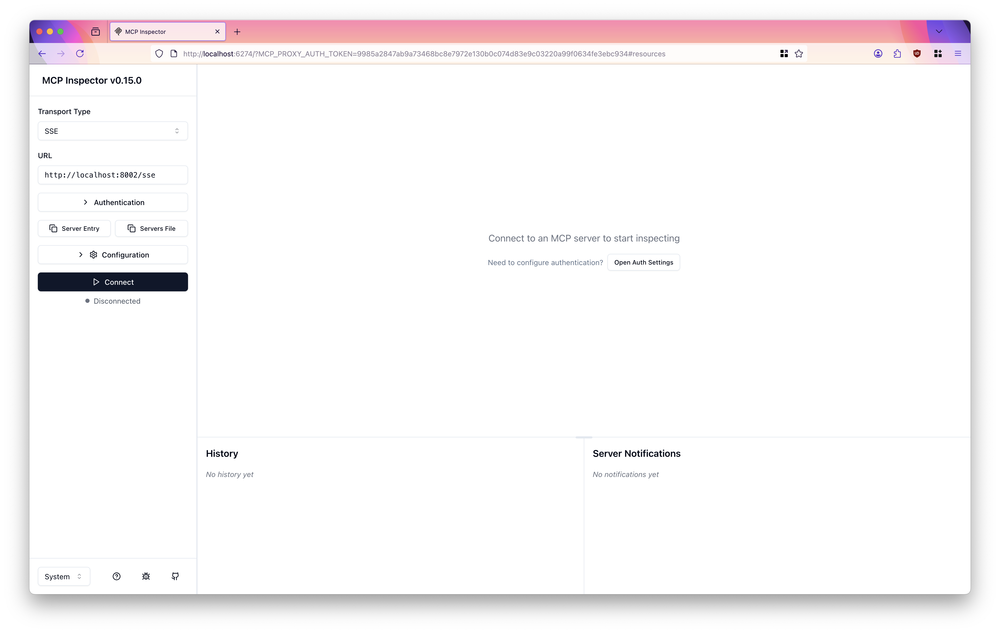
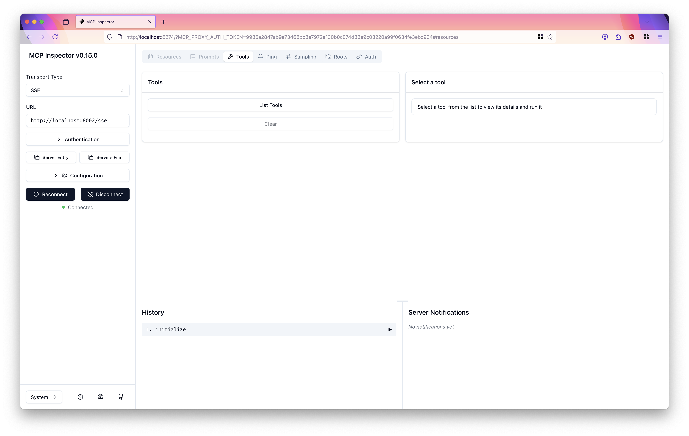
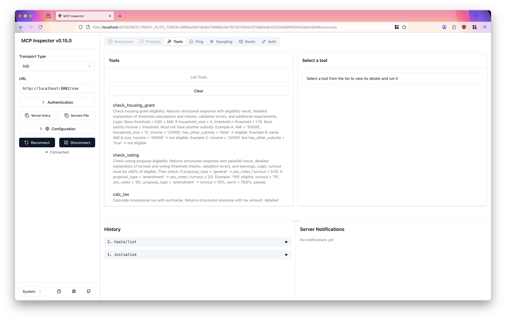
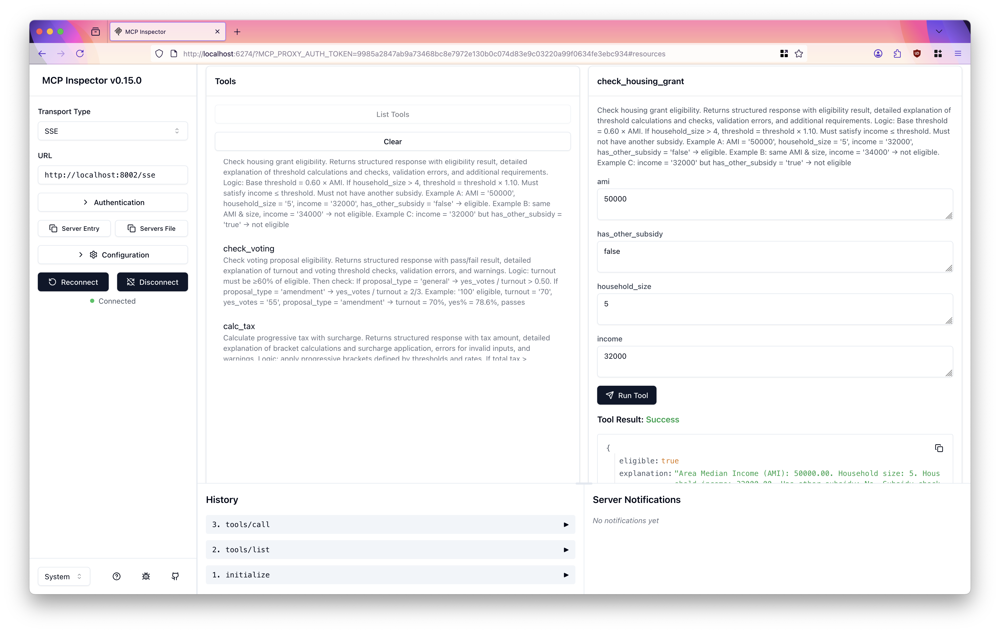
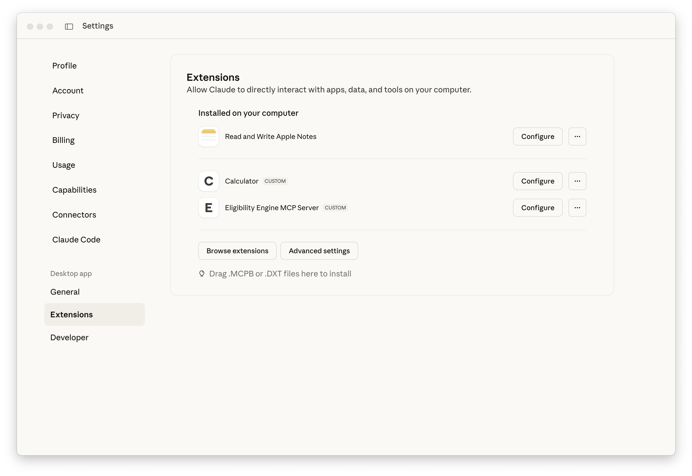
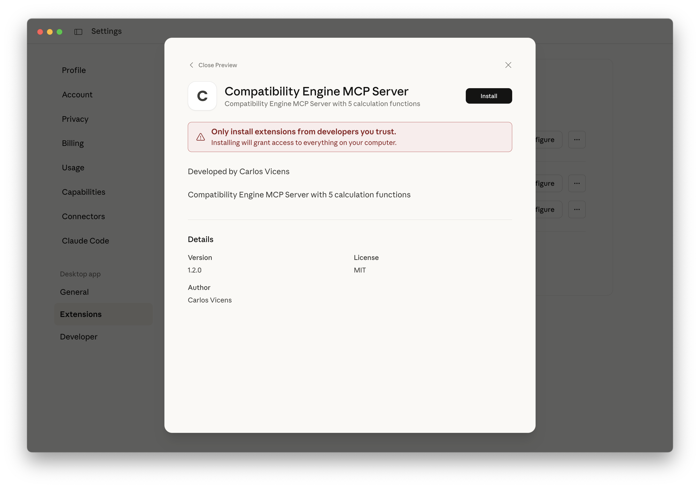
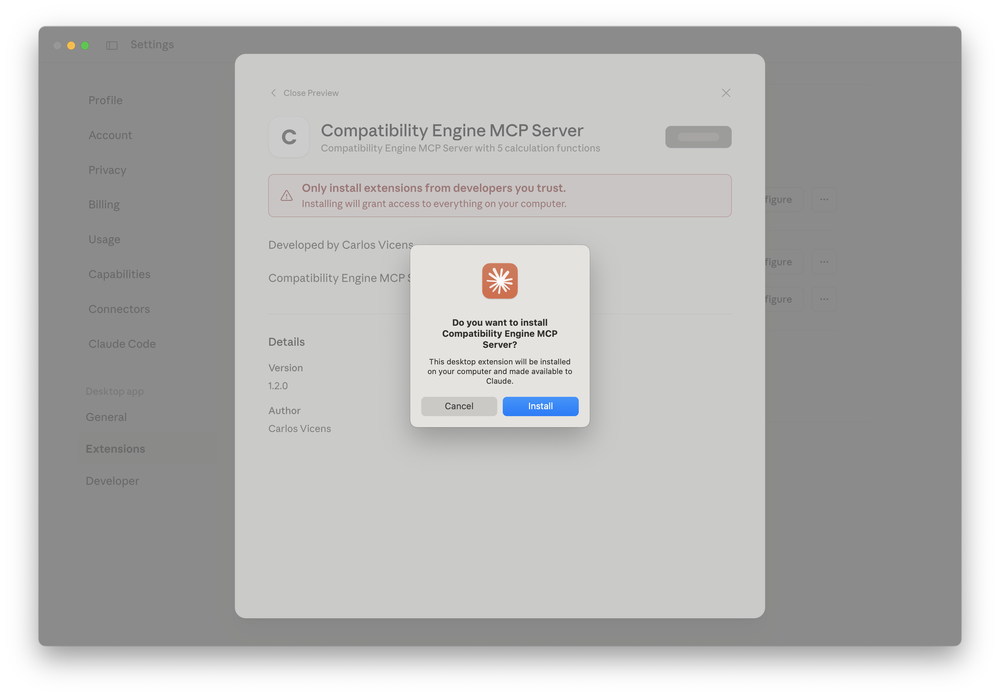
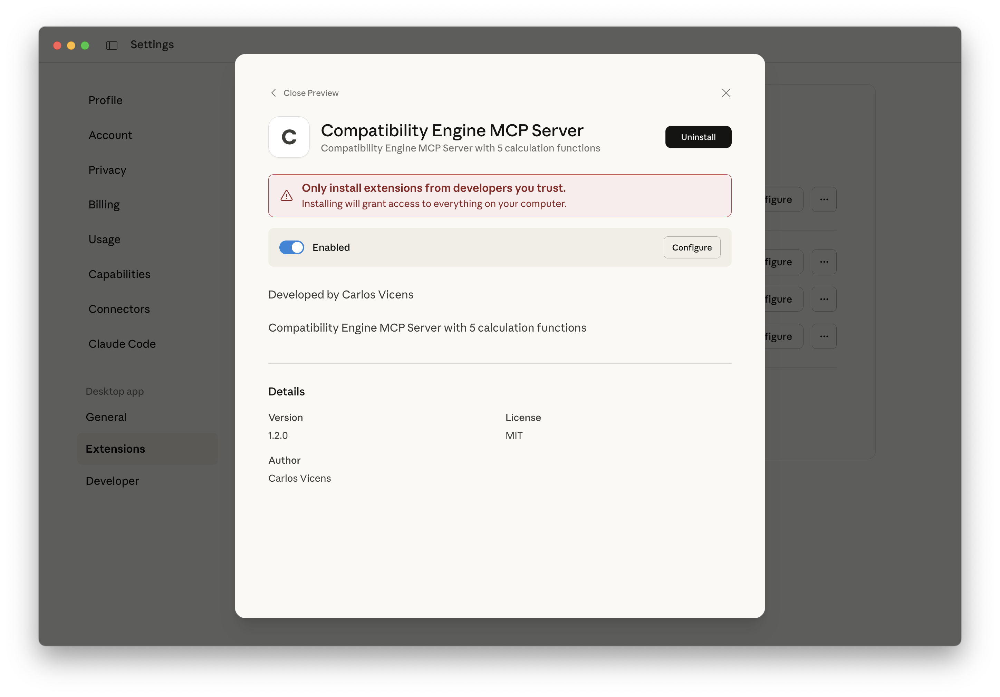
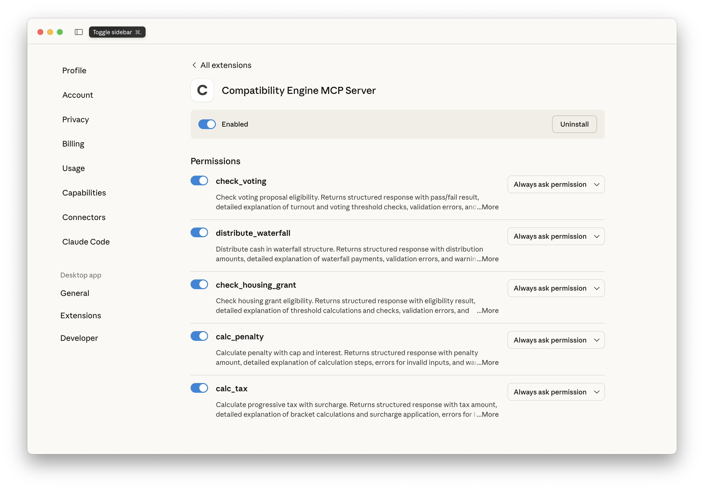
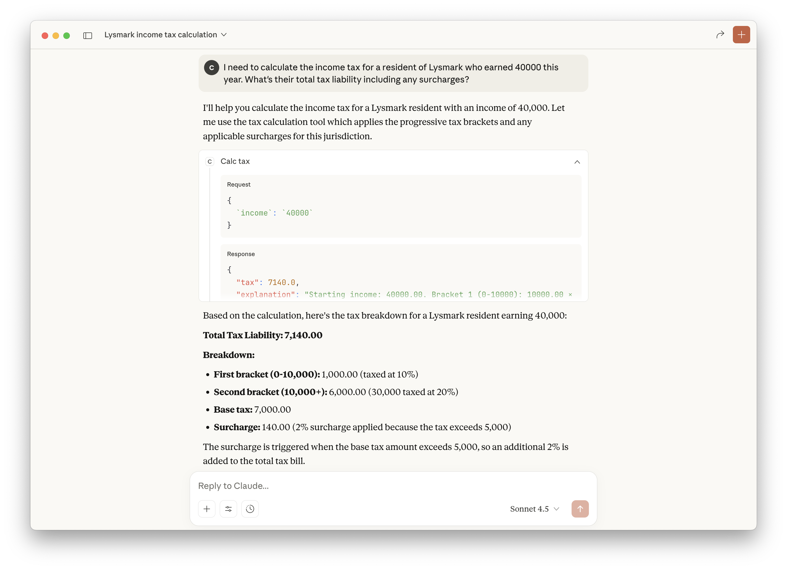

# Penalty Engine MCP Server

> **Example Model Context Protocol (MCP) Server providing a penalty calculation function**

[](https://github.com/alpha-hack-program/eligibility-engine-mcp-rs/actions/workflows/ci.yml)
[](https://opensource.org/licenses/MIT)
[](https://www.rust-lang.org/)

An example Model Context Protocol (MCP) server developed in Rust that provides a strongly-typed penalty calculation function. This project demonstrates how to build MCP servers with explicit computational logic.

## Why an MCP Server like this?

Enterprises who need to comply with regulations that make them to have their data secure and on-premise but at the same time want to leverage the power of AI usually rely on small models. These models alveit powerful some times are not capable enough to deal with complex, multi-step, logic and hence are not as realiable as a highly regulated environment needs.

Some references around this subject:
- [Mathematical Reasoning in Large Language Models: Assessing Logical and Arithmetic Errors across Wide Numerical Ranges](https://arxiv.org/abs/2502.08680)
- [The Validation Gap: A Mechanistic Analysis of How Language Models Compute Arithmetic but Fail to Validate It](https://arxiv.org/abs/2502.11771)
- [Self-Error-Instruct: Generalizing from Errors for LLMs Mathematical Reasoning](https://aclanthology.org/2025.acl-long.417.pdf)

## ⚠️ **DISCLAIMER**

This server provides a penalty calculation function that demonstrates explicit, transparent business logic.

**This is a demonstration/example project only.** The calculations and logic implemented here are for educational and demonstration purposes. This software:

- **Should NOT be used for actual financial or legal decisions**
- **Does NOT represent real business calculations**
- **Is NOT affiliated with any official entity**
- **Serves as a technical example of MCP server implementation**

For real financial or legal calculations, please consult appropriate professional services.

## Introduction

In fictional Lysmark Republic the Ministry of Technology and Innovation have started to build a ChatBOT to help their citizens with their queries and although they tried to build it around a naïve RAG soon they realized that queries like "What penalty applies for a 15-day delay?" weren't easy to resolve this way. As a small country at Lysmark Republic they tend to be frugal and prefer enginering solution over just throwing resources at problems.

So they decided to use agents and in order to provide tools to the agents in a standard way they built an MCP server starting with this legal document:

- [ACT No. 2025/73-JU, COMMERCIAL OBLIGATIONS AND LIQUIDATED DAMAGES ACT](./docs/2025_73_JU.md)

## 🎯 Features

- **Calculation Function**: calc_penalty
- **Explicit Logic**: No external dependencies - all logic is transparent and verifiable
- **Robust Input Validation**: Demonstrates JSON schema validation with detailed error handling
- **Containerization**: Example Podman setup for deployment
- **Claude Desktop Integration**: Example MCPB packaging for MCP integration
- **Professional Version Management**: Automated version sync with cargo-release
- **CI/CD Pipeline**: Comprehensive GitHub Actions workflow
- **Clean Repository Structure**: Organized scripts and clean project layout

## 📚 Quick Reference

| Task | Command | Description |
|------|---------|-------------|
| **🧪 Test** | `make test` | Run all tests |
| **🧪 Test MCP** | `make test-mcp` | Run MCP server with Streamable HTTP transport |
| **🚀 Release** | `make release-patch` | Create new patch release |
| **📦 Package** | `make pack` | Create Claude Desktop package |
| **🐳 Container** | `make image-build` | Build container image |
| **ℹ️ Help** | `make help` | Show all commands |

## 📋 Available Functions

| Function | Description | Example |
|----------|-------------|----------|
| **calc_penalty** | Calculate penalty with cap and interest | 12 days late × 100/day = 1,050 with interest |

> **Note**: This function demonstrates a common multi-step calculation pattern.

### Example Calculations

#### 🏛️ Penalty Calculation

If there's a **15 day delay**, then **penalty is $1,050**
- Base penalty: 15 days × $100 = $1,500
- Cap applied: $1,500 capped at $1,000
- Interest: $1,000 × 5.0% = $50
- **Total Penalty: $1,050**
- **Warning:** Base penalty exceeded cap of $1,000

### 💡 Usage Tips for LLM Integration

When querying the LLM with this MCP agent:

1. **Be specific with numbers** - Provide exact figures for calculations
2. **Include context** - Mention the policy, contract type, or jurisdiction
3. **Ask for explanations** - The tools provide detailed step-by-step breakdowns
4. **Ask for clarity** - The tool returns a step-by-step explanation
5. **Use natural language** - No need to know the exact API parameters

## 🚀 Quick Start

### Prerequisites

- Rust 1.70+ ([Install Rust](https://rustup.rs/))
- Cargo (included with Rust)
- `jq` for JSON processing ([Install jq](https://jqlang.github.io/jq/download/))
- `cargo-release` for version management: `cargo install cargo-release`
- NodeJS 19+ [has to be installed](https://nodejs.org/en/download) if you want to test the server with [MCP Inspector](https://modelcontextprotocol.io/docs/tools/inspector)

### 📥 Installation

```bash
# Clone the repository
git clone https://github.com/alpha-hack-program/compatibility-engine-mcp-rs.git#workshop
cd compatibility-engine-mcp-rs
```

### 🏗️ Build

```bash
# Build all servers
make build-all

# Or build individually
make build-mcp      # MCP Streamable HTTP Server
make build-stdio    # STDIO Server for Claude
```

### 🧪 Unit Testing

```bash
# Run all tests
make test
```

### 🏃‍♂️ Running

> **NOTE:**
>
> By default `BIND_ADDRESS=127.0.0.1:8000` for **Streamable HTTP**
>
> BUT in the *Makefile* `test-mcp` targets set `BIND_ADDRESS=0.0.0.0:8001`

```bash
# MCP Streamable HTTP Server
make test-mcp

# Or directly
RUST_LOG=info BIND_ADDRESS=127.0.0.1:8002 ./target/release/mcp_server
```

### 🧪 Testing With MCP Inspector

Let's run the MCP server with Streamable HTTP transport in one terminal:

```bash
make test-mcp
```

Run MCP inspector with `make inspector`:

> **NOTE:** NodeJS 19+ has to be installed

```bash
$ make inspector
npx @modelcontextprotocol/inspector
Starting MCP inspector...
⚙️ Proxy server listening on 127.0.0.1:6277
🔑 Session token: 6f0fdc22e2a9775a95d60c976b37b873bffec1816002fc702ca8ec7186a7c338
Use this token to authenticate requests or set DANGEROUSLY_OMIT_AUTH=true to disable auth

🔗 Open inspector with token pre-filled:
   http://localhost:6274/?MCP_PROXY_AUTH_TOKEN=6f0fdc22e2a9775a95d60c976b37b873bffec1816002fc702ca8ec7186a7c338

🔍 MCP Inspector is up and running at http://127.0.0.1:6274 🚀
```

Open a browser and point to the URL with the token pre-filled.



Make sure:
- **Transport Type:** `Streamable HTTP`
- **URL:** `http://localhost:8002/mcp`

Then click `connect`.



Now click on `List Tools`, then you should see the list of tools:



Finally click on `calc_penalty`, fill in the form and click `Run tool`:
- **days_late:** 12



Congratulations your Penalty tool is ready to be used by an MCP enabled agent.


## 📦 Claude Desktop Integration

### Packaging

```bash
# Create MCPB package for Claude Desktop
$ make pack
cargo build --release --bin stdio_server
   Compiling penalty-engine-mcp-server v1.0.8 (/Users/.../compatibility-engine-mcp-rs)
    Finished `release` profile [optimized] target(s) in 18.23s
Packing MCP server for Claude Desktop...
chmod +x ./target/release/stdio_server
zip -rX penalty-engine-mcp-server.mcpb -j mcpb/manifest.json ./target/release/stdio_server
updating: manifest.json (deflated 49%)
updating: stdio_server (deflated 63%)
```

### Example Claude Configuration

Open Claude Desktop and go to `Settings->Extensions` dropping area.


> **Note**: This demonstrates MCP integration patterns and is not intended for production use with real data.

Drag and drop the `MCPB` file.



Click on `Install`:



Click on `Install`:



Click on `Configure` then close the dialog.



Your're ready to go, open a new chat:



Use this example query "We had a 12-day delay on a contract. What penalty applies under our standard terms?":



Congratulation the tool works with Claude Desktop.

## 🔧 Configuration

### Environment Variables

```bash
# Logging level (debug, info, warn, error)
RUST_LOG=info           

# Or use BIND_ADDRESS directly
BIND_ADDRESS=127.0.0.1:8000
```

### Example Usage

#### Calculate Penalty with Interest

```json
{
  "days_late": 12
}
```

**Response:** `1050.0` (penalty capped at $1000 + 5% interest = $1050)

> **Important**: These are example calculations for demonstration purposes only.

## 🐳 Containerization

### Build and Run

This requires `podman` or `docker`. Configuration is managed through `.env` file.

```bash
# Build container image
scripts/image.sh build

# Run locally
scripts/image.sh run

# Run from remote registry
scripts/image.sh push
scripts/image.sh run-remote

# Show container information
scripts/image.sh info
```

### Environment Variables for Containers

```bash
# Production configuration
podman run -p 8001:8001 \
  -e BIND_ADDRESS=0.0.0.0:8001 \
  -e RUST_LOG=info \
  quay.io/dgarciap/penalty-engine-mcp-server:latest
```


## 🛠️ Development

### Available Commands

#### 🏗️ Build Commands
```bash
make build-all              # Build all servers
make build-mcp              # Build MCP server (streamable-http)
make build-sse              # Build SSE server
make build-stdio            # Build stdio server
make pack                   # Pack MCP server for Claude Desktop
```

#### 🚀 Release Commands (cargo-release)
```bash
make release-patch          # Create patch release (1.0.6 → 1.0.7)
make release-minor          # Create minor release (1.0.6 → 1.1.0)
make release-major          # Create major release (1.0.6 → 2.0.0)
make release-dry-run        # Show what release-patch would do
make sync-version           # Manually sync version to all files
```

#### 🧪 Test Commands
```bash
make test                   # Run all tests
make test-sse               # Test SSE server locally
make test-mcp               # Test MCP server locally
```

#### 🔧 Development Commands
```bash
make clean                  # Clean build artifacts
make help                   # Show all available commands
```

### Project Structure

```
├── src/                                    # Source code
│   ├── common/
│   │   ├── compatibility_engine.rs       # MCP logic and calculation functions
│   │   └── mod.rs
│   ├── sse_server.rs                      # SSE Server
│   ├── mcp_server.rs                      # MCP HTTP Server
│   └── stdio_server.rs                    # STDIO Server
├── scripts/                               # Utility scripts
│   ├── sync-manifest-version.sh           # Version sync for cargo-release
│   └── image.sh                          # Container management script
├── mcpb/
│   └── manifest.json                      # Claude Desktop manifest
├── .github/workflows/                     # CI/CD pipelines
│   └── ci.yml                            # GitHub Actions workflow
├── docs/                                  # Documentation
├── .env                                   # Environment variables
├── Containerfile                          # Container definition
├── Cargo.toml                            # Rust package manifest
└── Makefile                              # Build commands
```

### Function Parameters

#### calc_penalty
| Field | Type | Description |
|-------|------|-------------|
| `days_late` | number | Number of days late |
| `rate_per_day` | number | Rate per day |
| `cap` | number | Maximum penalty cap |
| `interest_rate` | number | Interest rate (decimal) |

## 🔒 Security

- **Input validation**: Strict JSON schemas
- **Non-root user**: Containers run as user `1001`
- **Security audit**: `cargo audit` in CI/CD
- **Minimal image**: Based on UBI 9 minimal

## 🤝 Contributing

### Development Workflow

1. **Fork the project**
2. **Create feature branch**: `git checkout -b feature/new-feature`
3. **Make changes and test**: `make test`
4. **Commit changes**: `git commit -am 'Add new feature'`
5. **Push to branch**: `git push origin feature/new-feature`
6. **Create Pull Request**

### Professional Release Process

1. **Development**: Make changes, test with `make test`
2. **Version Bump**: Use `make release-patch/minor/major`
3. **Build**: Use `make pack` for Claude Desktop integration
4. **Container**: Use `make image-build` for containerization

### Guidelines

- **Code Quality**: Follow `cargo fmt` and pass `cargo clippy`
- **Testing**: Add tests for new functionality
- **Version Management**: Let cargo-release handle versioning
- **CI/CD**: Ensure all GitHub Actions pass
- **Documentation**: Update README.md as needed
- **Professional Structure**: Keep scripts in `scripts/` directory

## ⚙️ Version Management

This project uses **cargo-release** for professional version management with automatic synchronization across all configuration files.

From `Cargo.toml` release configuration:

```toml
[package.metadata.release]
# Don't publish to crates.io (since this is a binary project)
publish = false
# Don't push git tags (you can enable this if you want)
push = false
# Run pre-release hook
pre-release-hook = ["scripts/sync-manifest-version.sh"]
# Create git tag with 'v' prefix
tag-name = "v{{version}}"
# Sign tags (optional)
sign-tag = false
```

### 🔄 Version Sync System

- **Single Source of Truth**: `Cargo.toml` version controls everything
- **Automatic Sync**: Updates `mcpb/manifest.json` and `.env` automatically
- **Git Integration**: Creates commits and tags automatically

### 📦 Release Workflow

Work on your code, then when happy with it:

```bash
# 1. Make your changes and commit them
git add -A && git commit -m "feat: your changes"

# 2. Create a release (choose appropriate version bump)
make release-patch     # Bug fixes: 1.0.6 → 1.0.7
make release-minor     # New features: 1.0.6 → 1.1.0  
make release-major     # Breaking changes: 1.0.6 → 2.0.0

# 3. Build and package
make pack
make image-build
make image-push

# 4. Push to repository
git push && git push --tags
```

### 🔍 Preview Changes

```bash
# See what would happen without making changes
make release-dry-run
```

### 🛠️ Manual Version Sync (Development)

```bash
# Sync version from Cargo.toml to other files manually
make sync-version
```

## 💬 Sample LLM Queries

When using this MCP agent with an LLM, users can ask natural language questions that trigger the appropriate calculation tools. Here are realistic scenarios:

### 🏛️ Penalty Calculations

#### Example 1: Extended Delay with Cap Applied
**Query:** "We have a client who is 15 days late on their contractual obligations. What penalty should we charge them according to our standard terms?"

**Result:** **$1,050**
- Base penalty: 15 days × $100 = $1,500
- Cap applied: $1,500 capped at $1,000
- Interest: $1,000 × 5.0% = $50
- **Total Penalty: $1,050**
- **Warning:** Base penalty exceeded cap of $1,000

#### Example 2: Minor Delay Under Cap
**Query:** "A vendor delivered our order 8 days late. Can you calculate the liquidated damages we should apply?"

**Result:** **$840**
- Base penalty: 8 days × $100 = $800
- No cap applied ($800 ≤ $1,000)
- Interest: $800 × 5.0% = $40
- **Total Penalty: $840**

#### Example 3: Significant Delay with Maximum Penalty
**Query:** "Our customer missed the payment deadline by 25 days. What's the total penalty including interest charges?"

**Result:** **$1,050**
- Base penalty: 25 days × $100 = $2,500
- Cap applied: $2,500 capped at $1,000
- Interest: $1,000 × 5.0% = $50
- **Total Penalty: $1,050**
- **Warning:** Base penalty exceeded cap of $1,000

#### Example 4: Moderate Delay with Cap Applied
**Query:** "Help me calculate the late delivery penalty for a project that was completed 12 days after the agreed deadline."

**Result:** **$1,050**
- Base penalty: 12 days × $100 = $1,200
- Cap applied: $1,200 capped at $1,000
- Interest: $1,000 × 5.0% = $50
- **Total Penalty: $1,050**
- **Warning:** Base penalty exceeded cap of $1,000

#### Penalty Calculation Rules
- **Daily Rate:** $100 per day late
- **Maximum Cap:** $1,000 (base penalty cannot exceed this amount)
- **Interest Rate:** 5% applied to the final penalty amount (after cap)
- **Calculation Order:** Daily penalty → apply cap → add interest
- **Warning System:** Alerts when base penalty exceeds the cap limit

*The LLM will use `calc_penalty` with the specified days and apply configured defaults (100/day rate, 1000 cap, 5% interest).*

## 📄 License

This project is licensed under the MIT License - see [LICENSE](LICENSE) for details.

### CI/CD Pipeline

The project includes a comprehensive GitHub Actions workflow:
- ✅ **Automated Testing**: Unit tests and integration tests
- ✅ **Version Sync Validation**: Tests cargo-release functionality  
- ✅ **Container Building**: Tests containerization process
- ✅ **Artifact Management**: Builds and uploads release artifacts
- ✅ **Cross-platform Support**: Tests on Ubuntu with multiple container runtimes

## 🙋 Support

- **Issues**: [GitHub Issues](https://github.com/alpha-hack-program/compatibility-engine-mcp-rs/issues)
- **Documentation**: [Project Wiki](https://github.com/alpha-hack-program/compatibility-engine-mcp-rs/wiki)
- **CI/CD**: Automated testing and deployment via GitHub Actions

## 🏷️ Tags

`mcp` `model-context-protocol` `rust` `penalty-engine` `penalty` `explicit-logic` `claude` `computation-engine` `cargo-release` `professional-rust` `containerization` `ci-cd`

---

**Developed with ❤️ by [Alpha Hack Group](https://github.com/alpha-hack-program)**