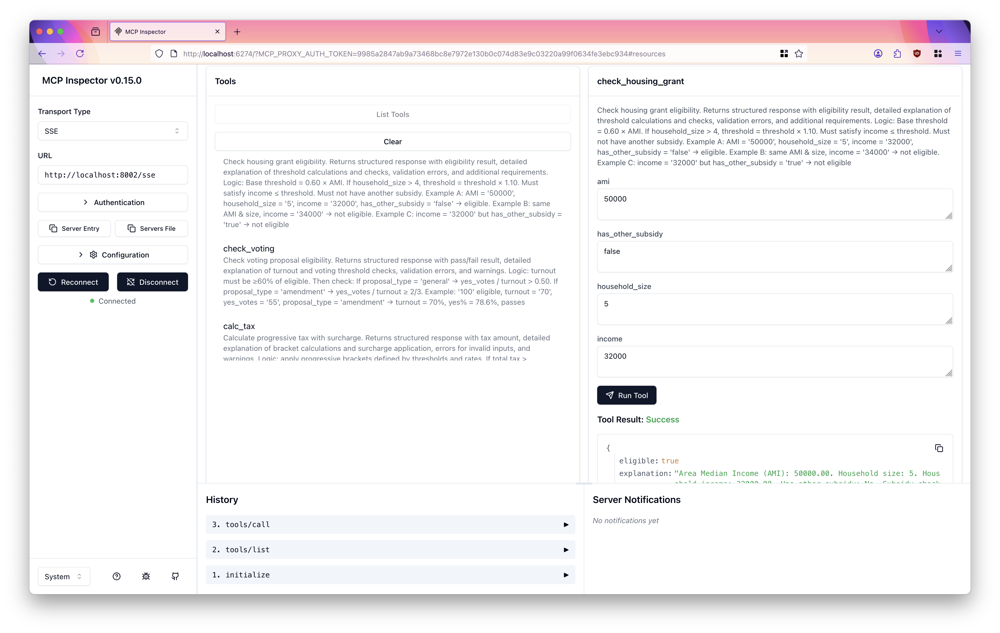
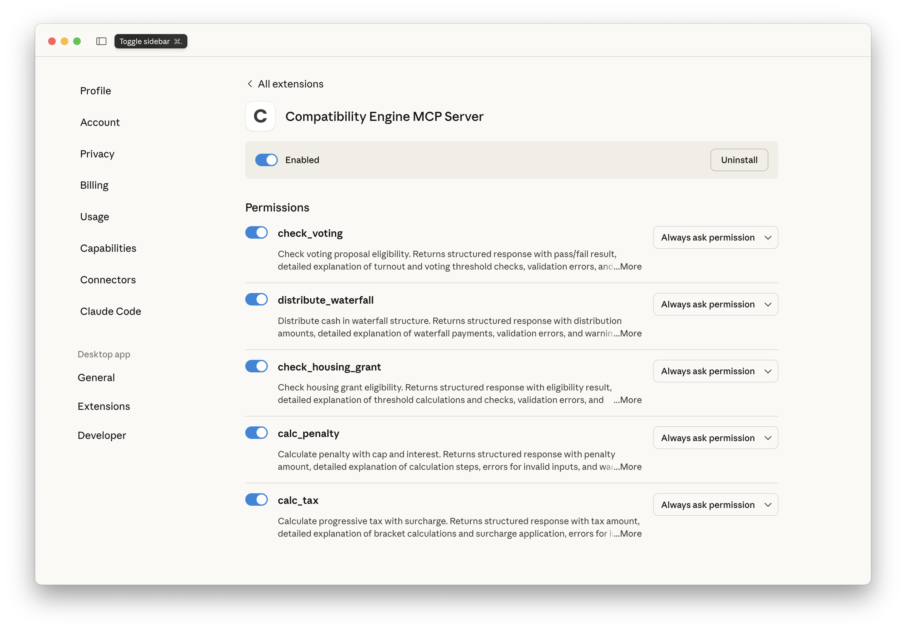
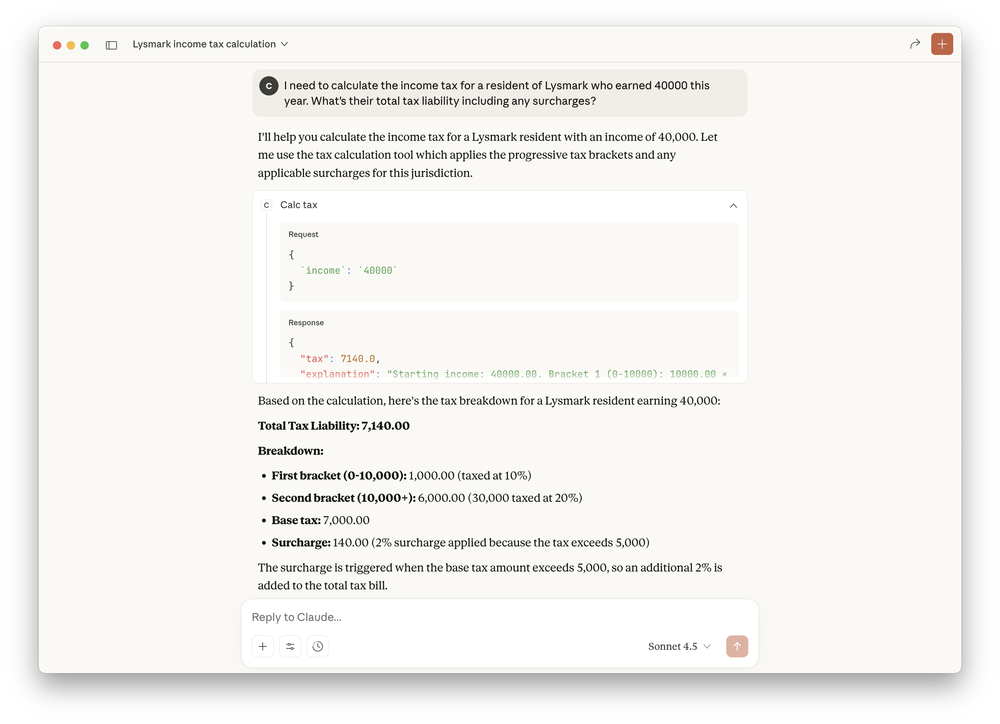

# Compatibility Engine MCP Server

> **Example Model Context Protocol (MCP) Server providing five calculation and compatibility functions**

[](https://github.com/alpha-hack-program/eligibility-engine-mcp-rs/actions/workflows/ci.yml)
[](https://opensource.org/licenses/MIT)
[](https://www.rust-lang.org/)

An example Model Context Protocol (MCP) server developed in Rust that provides five strongly-typed calculation and compatibility functions. This project demonstrates how to build MCP servers with explicit computational logic.

## Why an MCP Server like this?

Enterprises who need to comply with regulations that make them to have their data secure and on-premise but at the same time want to leverage the power of AI usually rely on small models. These models alveit powerful some times are not capable enough to deal with complex, multi-step, logic and hence are not as realiable as a highly regulated environment needs.

Some references around this subject:
- [Mathematical Reasoning in Large Language Models: Assessing Logical and Arithmetic Errors across Wide Numerical Ranges](https://arxiv.org/abs/2502.08680)
- [The Validation Gap: A Mechanistic Analysis of How Language Models Compute Arithmetic but Fail to Validate It](https://arxiv.org/abs/2502.11771)
- [Self-Error-Instruct: Generalizing from Errors for LLMs Mathematical Reasoning](https://aclanthology.org/2025.acl-long.417.pdf)

## ⚠️ **DISCLAIMER**

This server provides five calculation functions that demonstrate various computational patterns commonly used in business applications. All calculations are explicit and transparent.

**This is a demonstration/example project only.** The calculations and logic implemented here are for educational and demonstration purposes. This software:

- **Should NOT be used for actual financial or legal decisions**
- **Does NOT represent real business calculations**
- **Is NOT affiliated with any official entity**
- **Serves as a technical example of MCP server implementation**

For real financial or legal calculations, please consult appropriate professional services.

## Introduction

In fictional Lysmark Republic the Ministry of Technology and Innovation have started to build a ChatBOT to help their citizens with their queries and although they tried to build it around a naïve RAG soon they realized that queries like "My income is 40000 how much are my taxes?" weren't easy to resolve this way. As a small country at Lysmark Republic they tend to be frugal and prefer enginering solution over just throwing resources at problems.

So they decided to use agents and in order to provide tools to the agents in a standard way they built an MCP server starting with these legal documents:

- [ACT No. 2025/61-FR, PROGRESSIVE INCOME TAX AND SURCHARGE ACT](./docs/2025_61-FR.md)
- [GUIDANCE NOTE No. 2025/61-FR/INT](./docs/2025_61-FR_INT.md)
- [ACT No. 2025/102-SD, PUBLIC HOUSING ASSISTANCE ELIGIBILITY ACT](./docs/2025_102_SD.md)
- [ACT No. 2025/73-JU, COMMERCIAL OBLIGATIONS AND LIQUIDATED DAMAGES ACT](./docs/2025_73_JU.md)
- [ACT No. 2025/88-GD, ORGANIZATIONAL VOTING AND QUORUM ACT](./docs/2025_88_GD.md)
- [ACT No. 2025/94-FC, STRUCTURED FINANCE AND CREDITOR PRIORITY ACT](./docs/2025_94_FC.md)

## 🎯 Features

- **5 Calculation Functions**: calc_penalty, calc_tax, check_voting, distribute_waterfall, check_housing_grant
- **Explicit Logic**: No external dependencies - all logic is transparent and verifiable
- **Robust Input Validation**: Demonstrates JSON schema validation with detailed error handling
- **Containerization**: Example Podman setup for deployment
- **Claude Desktop Integration**: Example DXT packaging for MCP integration
- **Professional Version Management**: Automated version sync with cargo-release
- **CI/CD Pipeline**: Comprehensive GitHub Actions workflow
- **Clean Repository Structure**: Organized scripts and clean project layout

## 📚 Quick Reference

| Task | Command | Description |
|------|---------|-------------|
| **🧪 Test** | `make test` | Run all tests |
| **🧪 Test SSE** | `make test-sse` | Run MCP server with SSE transport |
| **🧪 Test MCP** | `make test-mcp` | Run MCP server with Streamable HTTP transport |
| **🚀 Release** | `make release-patch` | Create new patch release |
| **📦 Package** | `make pack` | Create Claude Desktop package |
| **🐳 Container** | `make image-build` | Build container image |
| **ℹ️ Help** | `make help` | Show all commands |

## 📋 Available Functions

| Function | Description | Example |
|----------|-------------|----------|
| **calc_penalty** | Calculate penalty with cap and interest | 12 days late × 100/day = 1,050 with interest |
| **calc_tax** | Progressive tax with surcharge | 40,000 income = 7,140 tax with surcharge |
| **check_voting** | Check voting proposal eligibility | 70 out of 100 voters, 55 yes votes = passes |
| **distribute_waterfall** | Distribute cash in waterfall structure | 15M → Senior: 8M, Junior: 7M, Equity: 0 |
| **check_housing_grant** | Check housing grant eligibility | AMI $50K, size 5, income $32K = eligible |

> **Note**: These functions demonstrate some common multi-tep calculation patterns.

### Example Calculations

#### 🏛️ Penalty Calculation

If there's a **15 day delay**, then **penalty is $1,050**
- Base penalty: 15 days × $100 = $1,500
- Cap applied: $1,500 capped at $1,000
- Interest: $1,000 × 5.0% = $50
- **Total Penalty: $1,050**
- **Warning:** Base penalty exceeded cap of $1,000

#### 💰 Tax Calculation

If **income was 40000** this year then **taxes will be $7,140**
- Bracket 1 (0-10,000): $10,000 × 10.0% = $1,000
- Bracket 2 (10,000+): $30,000 × 20.0% = $6,000
- Subtotal: $7,000
- Surcharge (tax > $5,000): $7,000 × 2.0% = $140
- **Total Tax: $7,140**

### 🗳️ Voting Validation

If we held a board meeting with **150 eligible voters**, **95 people participated** and **52 voted yes** on an ordinary resolution. then **voting ✅ PASSED with WARNING**
- Turnout: 95/150 (63.3%) - meets ≥60% requirement
- Yes votes: 52/95 (54.7%) - exceeds >50% requirement for general proposals
- **Warning:** Low turnout (below 70%)

### 💸 Waterfall Distributions

If we have 15 million in cash to distribute, then:
- Senior Debt: $8,000,000 (fully paid)
- Junior Debt: $7,000,000 (partially paid - $5M shortfall)
- Equity: $0
- **Warnings:** Junior debt underpaid by $5,000,000; Insufficient cash ($15M available vs $20M total debt)

### 🏠 Housing Grant Eligibility

If a family of 6 with household income of 35000 is applying for housing assistance, the local AMI is 60000 and they have no other housing subsidies, then:

**They are ✅ ELIGIBLE**
- Base threshold: 60% of AMI = $36,000
- Adjusted threshold: $39,600 (10% increase for household size > 4)
- Income: $35,000 ≤ $39,600 ✓
- No other subsidies ✓
- **Additional Requirements:** Proof of income, first-time homebuyer criteria, large household documentation

### 💡 Usage Tips for LLM Integration

When querying the LLM with this MCP agent:

1. **Be specific with numbers** - Provide exact figures for calculations
2. **Include context** - Mention if it's for Lysmark jurisdiction, voting type, household details
3. **Ask for explanations** - The tools provide detailed step-by-step breakdowns
4. **Combine scenarios** - You can ask about multiple calculations in one query
5. **Use natural language** - No need to know the exact API parameters

## 🚀 Quick Start

### Prerequisites

- Rust 1.70+ ([Install Rust](https://rustup.rs/))
- Cargo (included with Rust)
- `jq` for JSON processing ([Install jq](https://jqlang.github.io/jq/download/))
- `cargo-release` for version management: `cargo install cargo-release`
- NodeJS 19+ [has to be installed](https://nodejs.org/en/download) if you want to test the server with [MCP Inspector](https://modelcontextprotocol.io/docs/tools/inspector)

### 📥 Installation

```bash
# Clone the repository
git clone https://github.com/alpha-hack-program/compatibility-engine-mcp-rs.git
cd compatibility-engine-mcp-rs
```

### 🏗️ Build

```bash
# Build all servers
make build-all

# Or build individually
make build-sse      # SSE Server
make build-mcp      # MCP HTTP Server
make build-stdio    # STDIO Server for Claude
```

### 🧪 Unit Testing

```bash
# Run all tests
make test
```

### 🏃‍♂️ Running

> **NOTE:**
>
> By default `BIND_ADDRESS=127.0.0.1:8000` for **SSE** and `BIND_ADDRESS=127.0.0.1:8001` for **Streamable HTTP**
>
> BUT in the *Makefile* both `test-sse` and `test-mcp` targets set `BIND_ADDRESS=0.0.0.0:8001`

```bash
# SSE Server (recommended for Llama Stack, being deprecated in MCP Standard)
make test-sse

# MCP Streamable HTTP Server
make test-mcp

# Or directly
RUST_LOG=info BIND_ADDRESS=127.0.0.1:8002 ./target/release/sse_server
```

### 🧪 Testing With MCP Inspector

Let's run the MCP server with SSE transport in one terminal:

```bash
make test-sse
```

Run MCP inspector with `make inspector`:

> **NOTE:** NodeJS 19+ has to be installed

```bash
$ make inspector
npx @modelcontextprotocol/inspector
Starting MCP inspector...
⚙️ Proxy server listening on 127.0.0.1:6277
🔑 Session token: 6f0fdc22e2a9775a95d60c976b37b873bffec1816002fc702ca8ec7186a7c338
Use this token to authenticate requests or set DANGEROUSLY_OMIT_AUTH=true to disable auth

🔗 Open inspector with token pre-filled:
   http://localhost:6274/?MCP_PROXY_AUTH_TOKEN=6f0fdc22e2a9775a95d60c976b37b873bffec1816002fc702ca8ec7186a7c338

🔍 MCP Inspector is up and running at http://127.0.0.1:6274 🚀
```

Open a browser and point to the URL with the token pre-filled.


Make sure:
- **Transport Type:** `SSE`
- **URL:** `http://localhost:8002/sse`

Then click `connect`.


Now click on `List Tools`, then you should see the list of tools:


Finally click on `check_housing_grant`, fill in the form and click `Run tool`:
- **ami:** 50000
- **has_other_subsidy:** false
- **household_size:** 5
- **income:** 32000



Congratulations your Compatibility tool is ready to be used by an MCP enabled agent.


## 📦 Claude Desktop Integration

### Packaging

```bash
# Create DXT package for Claude Desktop
$ make pack
cargo build --release --bin stdio_server
   Compiling compatibility-engine-mcp-server v1.0.8 (/Users/.../compatibility-engine-mcp-rs)
    Finished `release` profile [optimized] target(s) in 18.23s
Packing MCP server for Claude Desktop...
chmod +x ./target/release/stdio_server
zip -rX compatibility-engine-mcp-server.dxt -j dxt/manifest.json ./target/release/stdio_server
updating: manifest.json (deflated 49%)
updating: stdio_server (deflated 63%)
```

### Example Claude Configuration

Open Claude Desktop and go to `Settings->Extensions` dropping area.


> **Note**: This demonstrates MCP integration patterns and is not intended for production use with real data.

Drag and drop the `DXT` file.


Click on `Install`:


Click on `Install`:


Click on `Configure` then close the dialog.


Your're ready to go, open a new chat:



Use this example query "I need to calculate the income tax for a resident of Lysmark who earned 40000 this year. What's their total tax liability including any surcharges?":



Congratulation the tool works with Claude Desktop.

## 🔧 Configuration

### Environment Variables

```bash
# Logging level (debug, info, warn, error)
RUST_LOG=info           

# Or use BIND_ADDRESS directly
BIND_ADDRESS=127.0.0.1:8000
```

### Example Usage

#### Calculate Penalty with Interest

```json
{
  "days_late": 12,
  "rate_per_day": 100,
  "cap": 1000,
  "interest_rate": 0.05
}
```

**Response:** `1050.0` (penalty capped at $1000 + 5% interest = $1050)

#### Calculate Progressive Tax

```json
{
  "income": 40000,
  "thresholds": [10000],
  "rates": [0.10, 0.20],
  "surcharge_threshold": 5000,
  "surcharge_rate": 0.02
}
```

**Response:** `7140.0` (progressive tax $7000 + 2% surcharge = $7140)

> **Important**: These are example calculations for demonstration purposes only.

## 🐳 Containerization

### Build and Run

This requires `podman` or `docker`. Configuration is managed through `.env` file.

```bash
# Build container image
scripts/image.sh build

# Run locally
scripts/image.sh run

# Run from remote registry
scripts/image.sh push
scripts/image.sh run-remote

# Show container information
scripts/image.sh info
```

### Environment Variables for Containers

```bash
# Production configuration
podman run -p 8001:8001 \
  -e BIND_ADDRESS=0.0.0.0:8001 \
  -e RUST_LOG=info \
  quay.io/atarazana/compatibility-engine-mcp-server:latest
```


## 🛠️ Development

### Available Commands

#### 🏗️ Build Commands
```bash
make build-all              # Build all servers
make build-mcp              # Build MCP server (streamable-http)
make build-sse              # Build SSE server
make build-stdio            # Build stdio server
make pack                   # Pack MCP server for Claude Desktop
```

#### 🚀 Release Commands (cargo-release)
```bash
make release-patch          # Create patch release (1.0.6 → 1.0.7)
make release-minor          # Create minor release (1.0.6 → 1.1.0)
make release-major          # Create major release (1.0.6 → 2.0.0)
make release-dry-run        # Show what release-patch would do
make sync-version           # Manually sync version to all files
```

#### 🧪 Test Commands
```bash
make test                   # Run all tests
make test-sse               # Test SSE server locally
make test-mcp               # Test MCP server locally
```

#### 🔧 Development Commands
```bash
make clean                  # Clean build artifacts
make help                   # Show all available commands
```

### Project Structure

```
├── src/                                    # Source code
│   ├── common/
│   │   ├── compatibility_engine.rs       # MCP logic and calculation functions
│   │   └── mod.rs
│   ├── sse_server.rs                      # SSE Server
│   ├── mcp_server.rs                      # MCP HTTP Server
│   └── stdio_server.rs                    # STDIO Server
├── scripts/                               # Utility scripts
│   ├── sync-manifest-version.sh           # Version sync for cargo-release
│   └── image.sh                          # Container management script
├── dxt/
│   └── manifest.json                      # Claude Desktop manifest
├── .github/workflows/                     # CI/CD pipelines
│   └── ci.yml                            # GitHub Actions workflow
├── docs/                                  # Documentation
├── .env                                   # Environment variables
├── Containerfile                          # Container definition
├── Cargo.toml                            # Rust package manifest
└── Makefile                              # Build commands
```

### Function Parameters

#### calc_penalty
| Field | Type | Description |
|-------|------|-------------|
| `days_late` | number | Number of days late |
| `rate_per_day` | number | Rate per day |
| `cap` | number | Maximum penalty cap |
| `interest_rate` | number | Interest rate (decimal) |

#### calc_tax
| Field | Type | Description |
|-------|------|-------------|
| `income` | number | Total income |
| `thresholds` | array | Tax bracket thresholds |
| `rates` | array | Tax rates for each bracket |
| `surcharge_threshold` | number | Surcharge threshold |
| `surcharge_rate` | number | Surcharge rate (decimal) |

#### check_voting
| Field | Type | Description |
|-------|------|-------------|
| `eligible_voters` | integer | Total eligible voters |
| `turnout` | integer | Actual turnout |
| `yes_votes` | integer | Number of yes votes |
| `proposal_type` | string | "general" or "amendment" |

#### distribute_waterfall
| Field | Type | Description |
|-------|------|-------------|
| `cash_available` | number | Total cash to distribute |
| `senior_debt` | number | Senior debt amount |
| `junior_debt` | number | Junior debt amount |

#### check_housing_grant
| Field | Type | Description |
|-------|------|-------------|
| `ami` | number | Area Median Income |
| `household_size` | integer | Household size |
| `income` | number | Household income |
| `has_other_subsidy` | boolean | Whether household has another subsidy |

## 🔒 Security

- **Input validation**: Strict JSON schemas
- **Non-root user**: Containers run as user `1001`
- **Security audit**: `cargo audit` in CI/CD
- **Minimal image**: Based on UBI 9 minimal

## 🤝 Contributing

### Development Workflow

1. **Fork the project**
2. **Create feature branch**: `git checkout -b feature/new-feature`
3. **Make changes and test**: `make test`
4. **Commit changes**: `git commit -am 'Add new feature'`
5. **Push to branch**: `git push origin feature/new-feature`
6. **Create Pull Request**

### Professional Release Process

1. **Development**: Make changes, test with `make test`
2. **Version Bump**: Use `make release-patch/minor/major`
3. **Build**: Use `make pack` for Claude Desktop integration
4. **Container**: Use `make image-build` for containerization

### Guidelines

- **Code Quality**: Follow `cargo fmt` and pass `cargo clippy`
- **Testing**: Add tests for new functionality
- **Version Management**: Let cargo-release handle versioning
- **CI/CD**: Ensure all GitHub Actions pass
- **Documentation**: Update README.md as needed
- **Professional Structure**: Keep scripts in `scripts/` directory

## ⚙️ Version Management

This project uses **cargo-release** for professional version management with automatic synchronization across all configuration files.

From `Cargo.toml` release configuration:

```toml
[package.metadata.release]
# Don't publish to crates.io (since this is a binary project)
publish = false
# Don't push git tags (you can enable this if you want)
push = false
# Run pre-release hook
pre-release-hook = ["scripts/sync-manifest-version.sh"]
# Create git tag with 'v' prefix
tag-name = "v{{version}}"
# Sign tags (optional)
sign-tag = false
```

### 🔄 Version Sync System

- **Single Source of Truth**: `Cargo.toml` version controls everything
- **Automatic Sync**: Updates `dxt/manifest.json` and `.env` automatically
- **Git Integration**: Creates commits and tags automatically

### 📦 Release Workflow

Work on your code, then when happy with it:

```bash
# 1. Make your changes and commit them
git add -A && git commit -m "feat: your changes"

# 2. Create a release (choose appropriate version bump)
make release-patch     # Bug fixes: 1.0.6 → 1.0.7
make release-minor     # New features: 1.0.6 → 1.1.0  
make release-major     # Breaking changes: 1.0.6 → 2.0.0

# 3. Build and package
make pack
make image-build
make image-push

# 4. Push to repository
git push && git push --tags
```

### 🔍 Preview Changes

```bash
# See what would happen without making changes
make release-dry-run
```

### 🛠️ Manual Version Sync (Development)

```bash
# Sync version from Cargo.toml to other files manually
make sync-version
```

## 💬 Sample LLM Queries

When using this MCP agent with an LLM, users can ask natural language questions that trigger the appropriate calculation tools. Here are realistic scenarios:

### 🏛️ Penalty Calculations

#### Example 1: Extended Delay with Cap Applied
**Query:** "We have a client who is 15 days late on their contractual obligations. What penalty should we charge them according to our standard terms?"

**Result:** **$1,050**
- Base penalty: 15 days × $100 = $1,500
- Cap applied: $1,500 capped at $1,000
- Interest: $1,000 × 5.0% = $50
- **Total Penalty: $1,050**
- **Warning:** Base penalty exceeded cap of $1,000

#### Example 2: Minor Delay Under Cap
**Query:** "A vendor delivered our order 8 days late. Can you calculate the liquidated damages we should apply?"

**Result:** **$840**
- Base penalty: 8 days × $100 = $800
- No cap applied ($800 ≤ $1,000)
- Interest: $800 × 5.0% = $40
- **Total Penalty: $840**

#### Example 3: Significant Delay with Maximum Penalty
**Query:** "Our customer missed the payment deadline by 25 days. What's the total penalty including interest charges?"

**Result:** **$1,050**
- Base penalty: 25 days × $100 = $2,500
- Cap applied: $2,500 capped at $1,000
- Interest: $1,000 × 5.0% = $50
- **Total Penalty: $1,050**
- **Warning:** Base penalty exceeded cap of $1,000

#### Example 4: Moderate Delay with Cap Applied
**Query:** "Help me calculate the late delivery penalty for a project that was completed 12 days after the agreed deadline."

**Result:** **$1,050**
- Base penalty: 12 days × $100 = $1,200
- Cap applied: $1,200 capped at $1,000
- Interest: $1,000 × 5.0% = $50
- **Total Penalty: $1,050**
- **Warning:** Base penalty exceeded cap of $1,000

#### Penalty Calculation Rules
- **Daily Rate:** $100 per day late
- **Maximum Cap:** $1,000 (base penalty cannot exceed this amount)
- **Interest Rate:** 5% applied to the final penalty amount (after cap)
- **Calculation Order:** Daily penalty → apply cap → add interest
- **Warning System:** Alerts when base penalty exceeds the cap limit

*The LLM will use `calc_penalty` with the specified days and apply configured defaults (100/day rate, 1000 cap, 5% interest).*

### 💰 Tax Calculations

#### Example 1: Mid-Income with Surcharge Applied
**Query:** "I need to calculate the income tax for a resident of Lysmark who earned 40000 this year. What's their total tax liability including any surcharges?"

**Result:** **$7,140**
- Bracket 1 (0-10,000): $10,000 × 10.0% = $1,000
- Bracket 2 (10,000+): $30,000 × 20.0% = $6,000
- Subtotal: $7,000
- Surcharge (tax > $5,000): $7,000 × 2.0% = $140
- **Total Tax: $7,140**

#### Example 2: Higher Income with Surcharge
**Query:** "Can you help me figure out the progressive tax calculation for someone with an annual income of 75000 in the Republic of Lysmark?"

**Result:** **$14,280**
- Bracket 1 (0-10,000): $10,000 × 10.0% = $1,000
- Bracket 2 (10,000+): $65,000 × 20.0% = $13,000
- Subtotal: $14,000
- Surcharge (tax > $5,000): $14,000 × 2.0% = $280
- **Total Tax: $14,280**

#### Example 3: High Income with Maximum Surcharge
**Query:** "A taxpayer in our system has declared income of 120000. What's their tax obligation under the current brackets and surcharge rules?"

**Result:** **$23,460**
- Bracket 1 (0-10,000): $10,000 × 10.0% = $1,000
- Bracket 2 (10,000+): $110,000 × 20.0% = $22,000
- Subtotal: $23,000
- Surcharge (tax > $5,000): $23,000 × 2.0% = $460
- **Total Tax: $23,460**

#### Example 4: Lower Income with No Surcharge
**Query:** "What would be the total tax (including surcharge) for a Lysmark resident earning 28000 annually?"

**Result:** **$4,600**
- Bracket 1 (0-10,000): $10,000 × 10.0% = $1,000
- Bracket 2 (10,000+): $18,000 × 20.0% = $3,600
- Subtotal: $4,600
- No surcharge (tax ≤ $5,000)
- **Total Tax: $4,600**

#### Progressive Tax System Rules
- **Bracket 1:** 0-$10,000 taxed at 10%
- **Bracket 2:** $10,000+ taxed at 20%
- **Surcharge:** 2% applied when total tax exceeds $5,000
- **Calculation Order:** Progressive brackets first, then surcharge applied to total tax amount

*The LLM will use `calc_tax` and apply Lysmark tax brackets (10% up to 10000, 20% above) plus surcharge rules (2% if tax > 5000).*

### 🗳️ Voting Validations

#### Example 1: Board Meeting (Ordinary Resolution)
**Query:** "We held a board meeting with 150 eligible voters. 95 people participated and 52 voted yes on an ordinary resolution. Did the proposal pass?"

**Result:** ✅ **PASSED** with WARNING
- Turnout: 95/150 (63.3%) - meets ≥60% requirement
- Yes votes: 52/95 (54.7%) - exceeds >50% requirement for general proposals
- Warning: Low turnout (below 70%)

#### Example 2: Shareholder Meeting (Charter Amendment)
**Query:** "Our shareholder meeting had 200 eligible participants, 130 showed up, and 88 voted in favor of amending the corporate charter. Is this amendment approved?"

**Result:** ✅ **PASSED** with WARNING
- Turnout: 130/200 (65.0%) - meets ≥60% requirement
- Yes votes: 88/130 (67.7%) - meets ≥66.7% requirement for amendments
- Warning: Low turnout (below 70%)

#### Example 3: Cooperative General Proposal
**Query:** "In our cooperative, we have 80 members eligible to vote. 55 attended the meeting and 35 voted yes on a general proposal. What's the outcome?"

**Result:** ✅ **PASSED** with WARNING
- Turnout: 55/80 (68.8%) - meets ≥60% requirement
- Yes votes: 35/55 (63.6%) - exceeds >50% requirement for general proposals
- Warning: Low turnout (below 70%)

#### Example 4: Constitutional Amendment Validation
**Query:** "Can you validate this voting result: 300 eligible voters, 185 turnout, 125 yes votes for a constitutional amendment?"

**Result:** ✅ **PASSED** with WARNING
- Turnout: 185/300 (61.7%) - meets ≥60% requirement
- Yes votes: 125/185 (67.6%) - meets ≥66.7% requirement for amendments
- Warning: Low turnout (below 70%)

#### Voting Requirements Summary
- **Minimum Turnout:** ≥60% of eligible voters
- **General Proposals:** >50% of votes cast
- **Amendments:** ≥66.7% of votes cast
- **Optimal Turnout:** ≥70% (to avoid warnings)

*The LLM will use `check_voting` to verify turnout requirements (≥60%) and approval thresholds (>50% for general, ≥66.7% for amendments).*

### 💸 Waterfall Distributions

#### Example 1: Mixed Distribution Scenario
**Query:** "We have 15 million in cash to distribute. Senior debt holders are owed 8 million and junior debt holders are owed 12 million. How should we allocate the funds?"

**Result:** 
- Senior Debt: $8,000,000 (fully paid)
- Junior Debt: $7,000,000 (partially paid - $5M shortfall)
- Equity: $0
- **Warnings:** Junior debt underpaid by $5,000,000; Insufficient cash ($15M available vs $20M total debt)

#### Example 2: Full Senior Payment with Junior Shortfall
**Query:** "Our liquidation proceeds total 22 million. We have 18 million in senior debt and 6 million in junior debt. What's the distribution to each class?"

**Result:**
- Senior Debt: $18,000,000 (fully paid)
- Junior Debt: $4,000,000 (partially paid - $2M shortfall)
- Equity: $0
- **Warnings:** Junior debt underpaid by $2,000,000; Insufficient cash ($22M available vs $24M total debt)

#### Example 3: Limited Distribution with Equity Question
**Query:** "Help me calculate the waterfall distribution: 5.5 million available, 4 million senior debt, 3 million junior debt. How much goes to equity?"

**Result:**
- Senior Debt: $4,000,000 (fully paid)
- Junior Debt: $1,500,000 (partially paid - $1.5M shortfall)
- Equity: $0 (no funds remaining)
- **Warnings:** Junior debt underpaid by $1,500,000; Insufficient cash ($5.5M available vs $7M total debt)

#### Example 4: Large Distribution with No Equity
**Query:** "We're distributing 30 million in proceeds with 15 million senior obligations and 20 million junior obligations. What's the allocation breakdown?"

**Result:**
- Senior Debt: $15,000,000 (fully paid)
- Junior Debt: $15,000,000 (partially paid - $5M shortfall)
- Equity: $0
- **Warnings:** Junior debt underpaid by $5,000,000; Insufficient cash ($30M available vs $35M total debt)

#### Waterfall Distribution Rules
- **Priority 1:** Senior debt (paid first, up to full amount owed)
- **Priority 2:** Junior debt (paid second, up to full amount owed)
- **Priority 3:** Equity (receives any remaining funds after all debt is satisfied)
- **Payment Order:** Sequential - junior debt only receives payments after senior debt is fully satisfied
- **Warnings Generated:** When junior debt cannot be fully paid or total cash is insufficient for all obligations

*The LLM will use `distribute_waterfall` to apply priority rules: senior debt paid first, then junior debt, remainder to equity.*

### 🏠 Housing Grant Eligibility

#### Example 1: Large Family with No Other Subsidies
**Query:** "A family of 6 with household income of 35000 is applying for housing assistance. The local AMI is 60000 and they have no other housing subsidies. Are they eligible?"

**Result:** ✅ **ELIGIBLE**
- Base threshold: 60% of AMI = $36,000
- Adjusted threshold: $39,600 (10% increase for household size > 4)
- Income: $35,000 ≤ $39,600 ✓
- No other subsidies ✓
- **Additional Requirements:** Proof of income, first-time homebuyer criteria, large household documentation

#### Example 2: Small Household Well Under Threshold
**Query:** "Can you check housing grant eligibility for a 3-person household earning 25000 annually? The Area Median Income here is 50000 and they're not receiving other aid."

**Result:** ✅ **ELIGIBLE**
- Base threshold: 60% of AMI = $30,000
- No household size adjustment (3 ≤ 4)
- Income: $25,000 ≤ $30,000 ✓
- No other subsidies ✓
- **Additional Requirements:** Proof of income, first-time homebuyer criteria

#### Example 3: Large Family with Existing Subsidy
**Query:** "We need to verify eligibility for a large family (7 members) with 40000 income. AMI is 65000 and they currently receive Section 8 housing assistance. What's their status?"

**Result:** ❌ **NOT ELIGIBLE**
- Reason: Already has another housing subsidy (Section 8)
- **Requirement:** Must not have any other housing subsidies or assistance

#### Example 4: Couple Close to Income Threshold
**Query:** "A couple (2-person household) earning 32000 wants to apply for our housing program. Local AMI is 55000 and they have no other subsidies. Do they qualify?"

**Result:** ✅ **ELIGIBLE**
- Base threshold: 60% of AMI = $33,000
- No household size adjustment (2 ≤ 4)
- Income: $32,000 ≤ $33,000 ✓
- No other subsidies ✓
- **Additional Requirements:** Proof of income, first-time homebuyer criteria, verify all deductions included (close to threshold)

#### Housing Grant Eligibility Rules
- **Base Income Threshold:** 60% of Area Median Income (AMI)
- **Large Household Adjustment:** 10% increase if household size > 4
- **Subsidy Restriction:** Cannot have any other housing subsidies
- **Documentation Required:** Proof of income and first-time homebuyer status
- **Special Considerations:** Large households and applicants near income thresholds may require additional verification

*The LLM will use `check_housing_grant` to check income limits (60% of AMI, +10% for households >4), subsidy exclusivity rules, and provide detailed eligibility determination.*

### 🔄 Complex Multi-Tool Scenarios

#### Example 1: Corporate Restructuring Analysis
**Query:** "We're restructuring a company with the following situation: 25 million in liquidation proceeds to distribute, 12 million senior debt, 18 million junior debt. The board vote was 180 eligible, 125 turnout, 85 yes votes for this restructuring plan. One of our contractors was 18 days late on deliverables. Can you help me understand all the financial and governance implications?"

**Analysis Results:**

**💰 Waterfall Distribution:**
- Senior Debt: $12,000,000 (fully paid)
- Junior Debt: $13,000,000 (partially paid - $5M shortfall)
- Equity: $0
- **Warnings:** Junior debt underpaid by $5,000,000; Insufficient cash ($25M vs $30M total debt)

**🗳️ Board Vote on Restructuring:**
- **Result: PASSED** ✅
- Turnout: 125/180 (69.4%) - meets ≥60% requirement
- Yes votes: 85/125 (68.0%) - exceeds >50% requirement for general proposals
- **Warning:** Low turnout (below 70%)

**⚖️ Contractor Penalty:**
- **Penalty: $1,050**
- Base penalty: 18 days × $100 = $1,800 (capped at $1,000)
- Interest: $1,000 × 5% = $50
- **Warning:** Base penalty exceeded cap

**Overall Implications:**
- Restructuring is legally approved despite low board engagement
- Junior creditors face significant losses ($5M shortfall)
- Additional contractor penalties reduce available cash by $1,050

---

#### Example 2: Multi-Client Compliance Assessment
**Query:** "I'm advising a client on multiple compliance issues: Their annual income is 95000 (need tax calculation), they're 22 days late on a contract (penalty calculation), they want to apply for housing assistance (family of 5, income 28000, AMI 45000, no other subsidies). What are all the financial impacts?"

**Analysis Results:**

**💸 Tax Liability (Income: $95,000):**
- **Total Tax: $18,360**
- Bracket 1 (0-10,000): $1,000
- Bracket 2 (10,000+): $17,000
- Surcharge (2%): $360

**⚖️ Contract Penalty (22 Days Late):**
- **Total Penalty: $1,050**
- Base penalty: 22 days × $100 = $2,200 (capped at $1,000)
- Interest: $1,000 × 5% = $50
- **Warning:** Base penalty exceeded cap

**🏠 Housing Grant Eligibility (Family of 5, Income: $28,000):**
- **Result: ELIGIBLE** ✅
- Base threshold: $27,000 (60% of AMI)
- Adjusted threshold: $29,700 (10% increase for large household)
- Income: $28,000 ≤ $29,700 ✓
- **Requirements:** Income documentation, first-time homebuyer criteria, large household documentation
- **Note:** Income very close to threshold - verify all deductions

**Financial Summary:**
- **Tax Obligation:** $18,360
- **Contract Penalty:** $1,050
- **Housing Assistance:** Qualified (potential benefit)
- **Total Financial Impact:** -$19,410 in obligations, plus potential housing assistance savings

**Recommendations:**
- Pay tax liability and penalty promptly to avoid additional interest
- Proceed with housing grant application immediately (income is close to threshold)
- Review contract management to prevent future penalties

*The LLM will use multiple tools (`distribute_waterfall`, `check_voting`, `calc_penalty`, `calc_tax`, `check_housing_grant`) and provide comprehensive analysis.*

## 📄 License

This project is licensed under the MIT License - see [LICENSE](LICENSE) for details.

### CI/CD Pipeline

The project includes a comprehensive GitHub Actions workflow:
- ✅ **Automated Testing**: Unit tests and integration tests
- ✅ **Version Sync Validation**: Tests cargo-release functionality  
- ✅ **Container Building**: Tests containerization process
- ✅ **Artifact Management**: Builds and uploads release artifacts
- ✅ **Cross-platform Support**: Tests on Ubuntu with multiple container runtimes

## 🙋 Support

- **Issues**: [GitHub Issues](https://github.com/alpha-hack-program/compatibility-engine-mcp-rs/issues)
- **Documentation**: [Project Wiki](https://github.com/alpha-hack-program/compatibility-engine-mcp-rs/wiki)
- **CI/CD**: Automated testing and deployment via GitHub Actions

## 🏷️ Tags

`mcp` `model-context-protocol` `rust` `compatibility-engine` `calculations` `explicit-logic` `claude` `computation-engine` `cargo-release` `professional-rust` `containerization` `ci-cd`

---

**Developed with ❤️ by [Alpha Hack Group](https://github.com/alpha-hack-program)**